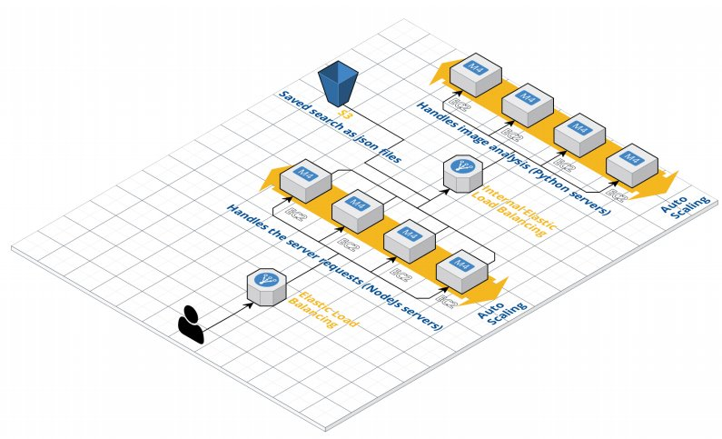

# cab432 cloud architecture
The second project of the QUT course CAB432.

## Cloud architecture
The application architecture consists of 5 parts: The client side, the 2 auto scaling
groups, the load balancers, and the S3 presistances services. The general
architecture can be seen in figure below. 

For more specific about the architecture please see chapter 3 in the report in the repo.

## Use case
This application allows its users to analyze large amounts of images from Flicker (“Flickr
Services,” n.d.) around a specific area. Using a CNN each image will be scanned for multiple items such as people, cars, cats, etc. The results of these scans
will provide the user with the locations of these items within the image and how many times
these items have been detected in the image.

The user starts by specifying its search parameters on the search settings page. The user
will be able to specify search parameters such as the location of interest, the area around
this location, the maximum amount of images to search, etc.

The user can specify the search location using a leaflet map. When the user click on the latitude or longitude
field a map will automatically open. The user only has to click on the map to specify the
search location.

Once the user has specified his search parameters the application will start the analysis.
While the application is performing the analysis the user will be provided with the
intermediate results on the analytics page. This page will contain a bar chart that will display
how often a specific class of items has been detected.

This page also provides the user with a list of images that have been scanned.
For each of these images the page will display which type of items have been detected on it.

The user can see the results of a specific image by clicking on it. This will open a modal with
a larger image. This image will contain rectangles that indicate the areas of each label.
These rectangles will also contain the label and how confident the neural network is about
the classification.

